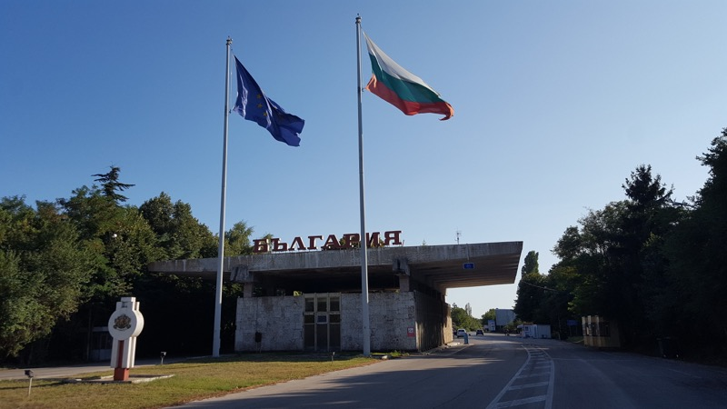

### Varna

Just one stop in Bulgaria, mainly as a stepping stone to Istanbul. It's a shame I can't spend a bit more time here, but I could say that about everywhere I've been and there is a need to prioritise. The black sea coast of Bulgaria, in my imagination, is a hellish place of concrete mega resorts, full of drunk people and hookers. The names of the places say it all: Sunny Beach, Golden Sands, names that suggest concrete, booze, sand, sea and vomiting Brits. Varna, though, is a pleasant surprise, it's a big enough city to have an existence that does not solely revolve around its beach. The city seems clean and civilised, with two large pedestrianised boulevards linking downtown with the coast. There are a few sights such as a pretty cathedral and the ruins of a Roman bath, interesting enough, but nothing to write home about. Really the city seems like the perfect place for an aimless stroll. I go into an all you can eat grill house and fill my belly with pork, muscles and heaps of salad to stave off the scurvy I contracted in Romania. The food in Bulgaria deserves a lot more credit than it gets on the international scene, it's really good and it sets my back only 5 euros! Coincidentally I bump into a guy I met back at Vama Veche in the hostel and he joins me for lunch, followed by a quick beer down the street. We went to a little shop selling a selection of craft beers, all delicious; Varna is the kind of trendy place where this kind of thing is becoming very popular. All the beers are made either on premise or nearby, and you can fill up a plastic bottle with a beer of your choice and sip it at the side of the shop in the company of travellers and Bulgarian hipsters. In the afternoon I have a quick swim in the sea once again, the beach is surprisingly clean and inviting, and the water is the perfect remedy for the hot August day, very refreshing. In the evening I meet a few Austrians and try out my German, they are politely impressed. We went down to the local free youth festival on the beach, where there were some heavy metal bands playing, but the place seemed a bit dead, and also not really my scene, so we headed back to the hostel for some light beers and chit-chat.

<figure>
  
  <figcaption>View as I cross from Romania to Bulgaria on foot.</figcaption>
</figure>

The next day I boarded a 10 hour bus to Istanbul, leaving behind Bulgaria after such a short time here, but the clock is ticking for my flight from Baku, so I must make some progress and need to do justice to the delights that Turkish has to offer (no pun intended).

Next stop the Sublime Porte, Byzantium, Constantinople, Istan-funking-bull here I come!
