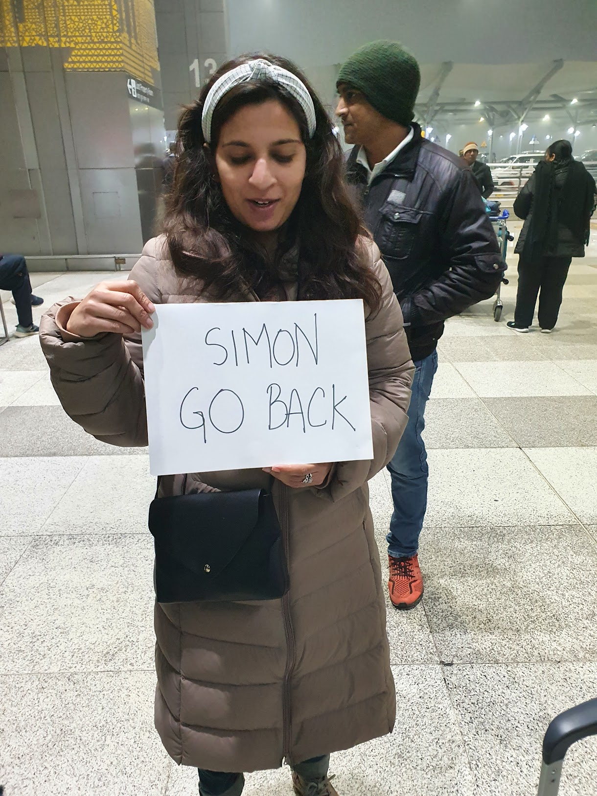
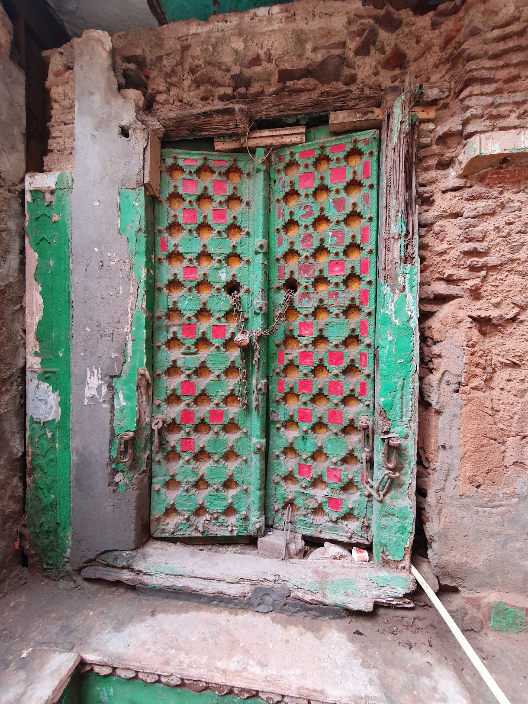
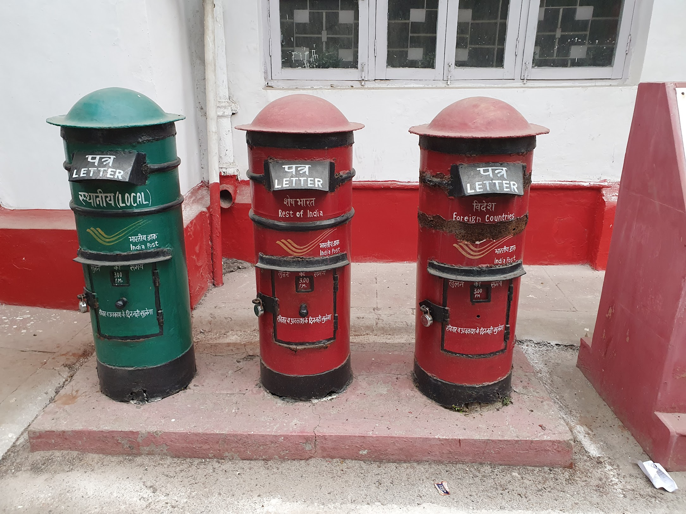
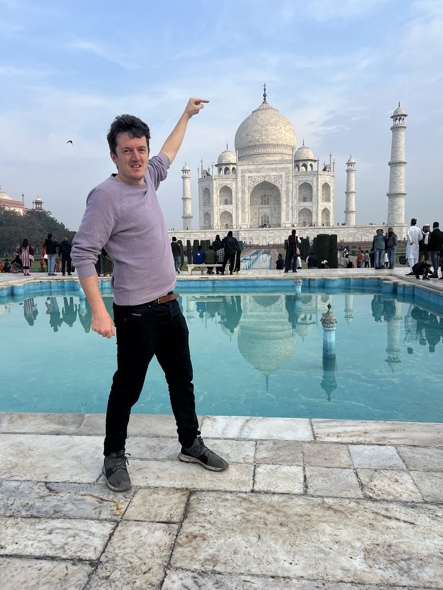
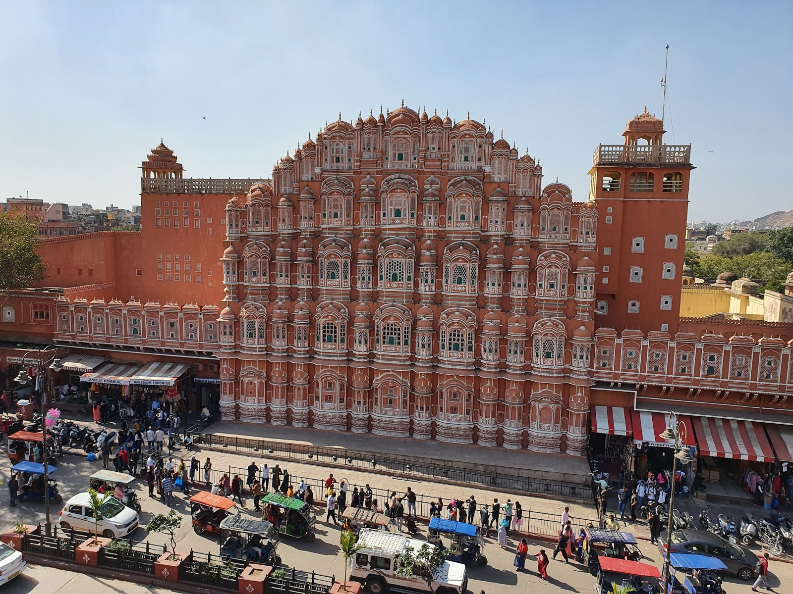
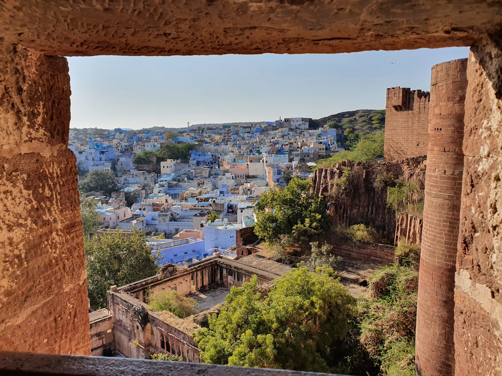
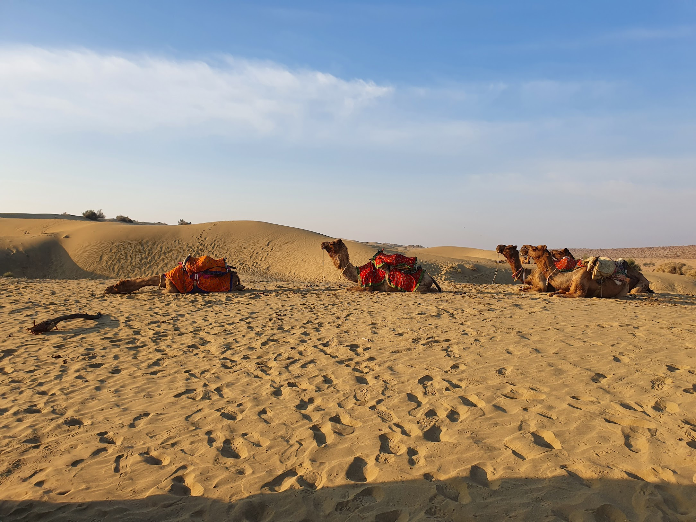
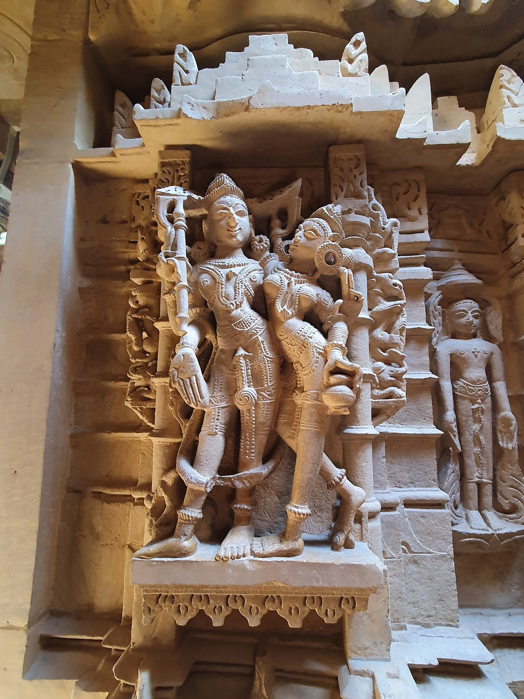

## Jan 2024

This time, I'm heading to India, and this time, I have company. In fact, my girlfriend hails from the subcontinent.

At Schiphol, I find my gate and know I'm in the right place immediately. The flight is dominated by Desis; just a few European tourists are outnumbered by the, presumably, expat Indians. There are approximately 32 million Indians who live outside of the motherland, about twice the population of the Netherlands.

Darkness quickly descends as we race towards the sun across Central Europe, Turkey, Iran, Pakistan; our destination, Delhi.

Of course, my native land, the UK, has some history with this place; we'll delve into the details later. My girlfriend is acutely aware of this but not without her sense of humour. That's why she greets me at arrivals, at 4 am, with a big sign saying "Simon Go Back." To get the joke, you need to know a little about Indian colonial history. For those not versed in such matters, let me briefly explain. In the 1920s, the British Parliament, controlling India, decided generously to draft them a constitution. The constitution was mostly written in London, with very little (read: no) involvement of Indians. The locals were none too happy about this and staged protests to register their displeasure with their pink-skinned overlords. The head of the British commission that wrote the Indian constitution was a man named John Simon. And so, the Indian independence movement adopted the slogan "Simon go back" as its rallying call. And so, 100 years later, I'm greeted at Delhi airport with this very slogan.

<figure>
  
  <figcaption>Simon Go Back!</figcaption>
</figure>

### Day 2

On the drive to the house, I saw absolutely nothing of the city in which I had arrived. A dense fog had descended on Delhi, and I couldn’t see the side of the road on which we were driving, let alone any of the grand buildings that, I’m told, line the streets of Lutyens' Delhi. We reached the house past the 5 am mark and went straight to bed.

I awoke with a groggy start, having no idea what time it was or even where I was. It was 1 pm, but it felt like early morning. Never a morning person, it would take me a little while to get adjusted to waking up at a locally acceptable time. No worries. We’re here for three weeks and can afford a lazy day here or there.

I reunited with my mother-in-law and settled down to some coffee and breakfast. We’re in a grand house in the heart of Lutyens' Delhi, a fancy postcode among Delhi-wallahs. My mother-in-law lives mostly by herself but is able to employ two full-time cleaners, a chef, a driver, and a part-time gardener to run her household. It feels a little bit weird to be waited on in this way. Breakfast and coffee are brought to me by a demure man who avoids smiling or making eye contact. Awkward as it feels, I must begrudgingly admit that I don’t totally hate the idea of this life.

Anyway, I can’t hang around being served omelettes all day long; we should do a bit of sightseeing. We don’t have long today, what with my long jet-lag-induced lie-in and my lazy aristocratic breakfast. So we restrict ourselves to one local sight: Purana Qila, or “the old fort.” A Mughal fort that, when built, was well outside the city of Delhi, but now sits quite comfortably within the bounds of New Delhi.

I’m expecting crazy bustle, carnage, and colourful chaos, but I’m disappointed. Everything is rather sedate here. One could almost say, if it’s not too loaded a word: civilised. There are only a few other tourists, mostly Indians, often young couples who come here to covertly canoodle in the cool alleyways of the emperor Humayun’s elegant archways. No one pays me any heed. I like the place—relaxed, impressive, ad-hoc; the warden in charge of the place has his washing on a line strung between crumbling brickwork. Not Delhi’s most impressive sight, but a nice introduction to all things Mughal (of which we would have our fill later).

In the late afternoon, we headed to Khan Market. This is not the bustling Indian bazaar of the romantic European’s imagination; it’s a hip, if higgledy-piggledy, collection of clothes shops, hipster coffee emporiums, and struggling bookshops. One such bookshop caught my imagination. It’s just one row, barely wide enough for a single human to slide through, piled with towers of seemingly randomly chosen books. There seems to be no system, just piles and piles of paper. By simply breathing the musty, papery air in the narrow walkway, one feels intellectual. Anyway, that’s about it for today. I’m still acclimating.

### Day 3

I’ve been in the subcontinent for about 36 hours and have not yet shaken that surreal feeling of not really being here. But we’re going to try to slowly ramp up the sightseeing today, starting with Humayun’s Tomb.

Let’s quickly prime you on the Mughals, as they’ll feature rather a lot if you ever visit Northern India.

They descended from Genghis Khan, who conquered much of central Asia. The name "Mongol" slowly became "Mughal" (or sometimes "Moghul"). They came from what is now Uzbekistan and swept through the subcontinent, forming an empire and a dynasty that, at its zenith, included everything we now call India, Pakistan, and Bangladesh, as well as a good sliver of Afghanistan. While Genghis Khan was not a Muslim, his descendants had mostly adopted the religion after conquering many of the great mediaeval Islamic cities of the day. Consequently, much to the rancour of many Hindu nationalists, this vast land became an Islamic empire.

Babur was the first Mughal emperor, and he did most of the conquering and war-mongering before establishing the boundaries of the Empire. His name sounds a bit like “barber,” which helps you remember it. Barbers were quite significant to the Mughal emperors, although the similarity in name is probably a coincidence.

Humayun, the second Mughal, was an interesting fellow. He’s the one whose tomb we’re about to visit. He temporarily lost his entire empire to another ruler, ran away to Persia, where he managed to raise an army, and reconquer India. He brought with him many Persians, infusing upper-class Indian culture with Persian influence that we can still see today. He loved books almost as much as he loved war, but it was ironically the former that led to his downfall. Just a year after regaining the top spot in Delhi, he fell down the staircase of his enormous library and died.

Akbar, while no saint, was relatively tolerant by the standards of the time. He brought together representatives of all the major religions of the region, found merit in all they had to say, built Hindu temples as well as mosques, and generally fostered a better sense of coexistence.

Jahangir, I don't know much about this one, google him if you really care.

Shah Jahan is mostly famous for building the Taj Mahal, which we’ll later go and see.

Aurangzeb is generally considered to be a notorious figure by most historians. Interestingly, the road where my in-laws live was named after him, but he has since been "cancelled" by the BJP, and the road has been renamed.

There were a few more incompetent nincompoops after Aurangzeb, who presided over a disastrous decline in fortunes, before losing the empire to the British. Although the British let them rule in name for a while longer, they were never more than puppets.

Anyway, Humayun, the second one, who lost and regained the empire and then fell down the stairs— we’re at his tomb.

We want a guide to show us around and give the grand, crumbling bricks a bit of context. At the entrance, we talk to a guy, who rings another guy, who knows a guy, who shows up in a tuk-tuk 20 minutes later and offers to show us around.

The guide was one of the best we had on our whole trip. He boasts of having shown many world leaders around the site, not least of all Boris Johnson, and claims that he demanded the Kohinoor back from him while showing him around.

Now, if you were paying attention, you’d know that Humayun is the grandfather of the emperor who built the Taj Mahal. In fact, Humayun's Tomb served as a sort of prototype -or at least an inspiration for- the Taj Mahal. You can see it in the proportions, the symmetry, and the ambitious scale of the building, although the building materials are quite different. It must be said that the Taj Mahal is more impressive, this being the first attempt and all, but on the plus side, Humayun’s Tomb can be enjoyed with a fraction of the crowds, which makes the experience that much more special.

Our guide sprinkles funny anecdotes with fascinating tidbits of historical knowledge. For instance, there’s a whole codification of graves in Mughal culture. The shapes and positioning of each grave tell you whether the person was a man or woman, married or not, whether they had children, their birth- and death- order. If you learn to read these tombs, you can find out all these things about the long-dead people entombed within.

Another fascinating tidbit: the steps leading to the platform are twice as steep on the west-facing side. The reason is that the west faces Mecca, and to descend steps this steep, one must bow their head. So, by design, we’re forced to bow our heads when facing Mecca.

One more: the barber of the Mughal emperor was considered one of the most important people in the emperor's inner retinue. So much so that the second largest tomb on the grounds is where Humayun’s barber is housed. Why exactly? The barber shaved the emperor with a sharp blade every morning. If the emperor's enemies got to him, he would serve as the perfect assassin. Therefore, they kept him close and treated him well.

Enough. We’ve learned so much, and I’m impressed with the ambitious scale of those old buildings.

The rest of the day is spent wandering through little parks and marvelling at the monkeys who have free rein of the place, then drinking hipster coffee.

### Day 4

OK, OK, admit it. The India of your imagination is full of vibrant squalor. Of rickshaw drivers dodging around defecating cows. Of semi-naked children, covered in filth, begging for your tourist dollar. Of swirling dubious scents and shady scams; of women handing you their babies, and most of all, of grinding poverty that horrifies and titillates in equal measure. Go on, admit it; I won’t tell anyone. But the India we have seen so far hasn’t been that India. But today it will be. Today we’re going to Old Delhi.

Otherwise known as Shahjahanabad. Remember him? He was one of the Mughals, specifically the one who built the Taj Mahal. The old town of Delhi was also built by- and is subsequently named after- him.

We met our guide and a couple of other tourists on the outskirts of the old town, where we were to take a metro into the epicentre of the chaos itself. Taking the metro is part of the experience. It’s chaotic and grand, as one might imagine, and there’s a separate carriage just for women, as bottom pinchers are, unfortunately, rife.

The town itself is the squalid chaos of the imagination. Deafening, nerve-wrenching, and utterly fascinating. This is why I came here (but don’t tell anyone).

<figure>
  
  <figcaption>A typical old door in old Delhi</figcaption>
</figure>

The first stop of note is the Jama Masjid, the Mughals' very own mosque. It’s one of, if not the, largest mosques on the subcontinent. It’s definitely massive. But its grand scale comes not in the size of the building itself, but in the vastness of the courtyard where the devoted gather. One can imagine tens of thousands of worshipers bowing in unison here come Eid.

It’s clearly an Islamic building, but it’s infused with little hints of Hinduism—an example of the fusion of cultures that occurred here under the Mughals.

And the street food—delicious, but only for those brave of heart and strong of stomach. A ride in a cycle rickshaw, with a view to the Red Fort. The extensive spice markets—touristy, but amazing nonetheless.

In the afternoon, we headed to the Red Fort. It’s a big, no, really big, red fort. Hence the name. But we’re a bit over-touristed and grumpy. A mood exacerbated by an event being held at the entrance, necessitating a 30-minute diversionary walk through busy traffic. I’m impressed by the scale. Red bricks the size of buffaloes form an outer perimeter for what was really an entire fortified town. After aimlessly traipsing, we backtrack and decide to take a guide. He’s a bit of a nutter, telling us in detail about his health routine and dietary recommendations with much more enthusiasm than he recounts the history of this place. But it’s entertaining in its own way.

### Day 5

Today I leave my girlfriend behind to explore a bit on my own. Two main stops for me. The first is Lodhi Gardens. A pleasant park strewn with ruins from a pre-Mughal era. In fact, the Lodhi’s were a dynasty just before the Mughals crashed onto the scene. The architecture is noticeably different. It hints more at Southeast Asia to my uneducated eyes, whereas the Mughal stuff makes me think much more of Central Asia. It seems much more exotic—a very personal and relative feeling, but one I feel nonetheless.

And in the afternoon, it’s Qutub Minar, the world's tallest brick minaret. This one also predates the Mughals. I’m running out of inventive ways of saying that a building is of impressive scale, but this structure is indeed impressive. It’s very, very tall in a way that pictures never do justice. I’m impressed—well done.

I have to navigate my way back now without my local guide. Uber seems like a safe bet, so I walk past the cat-calling tuk-tuk (here called “auto”) drivers, who goad me, saying that they are cheaper than Uber and that I’m an idiot. Uber doesn’t work, so I go back with my tail between my legs and negotiate.

In the evening, we go to a fancy modern Indian restaurant and enjoy a multi-course tasting menu in style—mixing indulgence with the squalor. Another day down in Delhi, and still so much to see, but tomorrow we are going to Agra and to the Taj Mahal.

### Day 6

Agra. Everyone who’s been there hates it. Yet half the world seems to visit. Most do so for one reason only: to see the monument to Shah Jahan’s wife (or at least one of his wives). Yes, that’s right, it’s Taj Mahal time.

The government has constructed a massive elevated highway so that one can visit the Taj Mahal without really seeing Agra itself. A feature, not a bug. Agra is squalor on crack. I feel guilty driving through in my chauffeur-driven, leather-seated, air-conditioned vehicle, past the mandatory semi-naked children covered in grime and sadness, who seem to live on and in the road.

So the Taj Mahal is the only reason one comes here. But not so fast! We have something else in mind before blowing our Mahal load: the cantonment of Agra. While we are not in the business of skipping the main sites of a place, we are also keen to mix in a bit of road-less-travelled tourism. And this tour is certainly that. A Sikh man with a military background is to be our guide to the cantonment. But what is a cantonment? I hear you ask. Unless you’re a real-life Indian, or perhaps an aficionado of the British Raj, you probably don’t know the name. It’s a French word, or at least the offspring of a French word, meaning military encampment. There are sixty-odd cantonments scattered around India. It’s where the British set up camp to rule over the locals. Although the word means something like “barracks,” they were more like little towns. Little bits of Britain grafted onto the subcontinent, complete with churches, post offices, and housing for the officers. A little town where Indians were not allowed in.

<figure>
  
  <figcaption>Typically British, but also very Indian post boxed in the cantonment of Agra.</figcaption>
</figure>

At least most Indians. Because each British officer had an army of help to run his household. Where I’m from the word bungalow has rather modest connotations, but here they are more like little palaces. And palaces, and their pink-skinned maharajas, needed an army of servants to cater to their needs. A man of modest means could make quite a life for himself here; no wonder they didn’t want to leave.

Now the history of colonialism is one of pain and shame for the natives and thus not all that talked about by the locals. But this history is, while no doubt gruesome, also fascinating and as much a part of history as the regal grandeur of the Mughals. The British didn’t build on the large scale as the Mughals (what would the British Taj Mahal be, for instance?), but they certainly had their own style. Or rather they had a style which merged with the local style, adding another layer to the already heavily layered history, to create something new and distinct. Both familiar and wholly alien to my Firangi eyes.

The tour takes in a number of grand bungalows, a post office, an officers club, and an Anglican church. All lying in a kind of uncanny valley of familiarity; subcontinental architecture is supposed to be all exotic mosques and exquisite temples, but this is an exotic post office. It still functions as one. I feel at home despite the muggy February heat.

The church is the last stop. Mainly for the soldiers and their families, rather than the converted locals. Each pew has a little rivet, no bigger than a coffee mug. What might these be for, asks our guide coyly. The answer, the little lady guessed correctly, was for their guns. Even in worship, the British soldiers must stay vigilant.

It’s worth pausing for a moment to think about what was going on here. In the mid-19th century, the British troops were outnumbered by the locals by about a factor of 4000. That meant that at any moment, the local population, if they collectively organised themselves, could turn around and say, ‘no f\*\*\* this’. In 1857, they did just that. More about that later.

We must inevitably jump around in both time and place, as tomorrow we are visiting the Taj Mahal.

### Day 7

The Taj Mahal is a festival of both exquisite architecture and human madness. It’s known for being crowded and hectic, so we set off pretty early to beat the crowds. It’s busy, but it’s not "India busy," and we are able to enjoy it, if not in tranquillity, then in bearable bustle.

Many great monuments underwhelm. The Colosseum seemed tiny to me compared to the colossal building built in my imagination, really the size of a championship team’s football stadium. The pyramids, I’m told, are so embedded in the grime of modern-day Cairo that they can’t fail to disappoint. Stonehenge is set so close to a busy motorway as to lose all romance. The Taj Mahal does not, for me, fall into this category. It’s impressive. It’s impressive because, not to be coarse about it, it’s fucking massive. It far exceeds the scale I had imagined. It also glows in a surreal, translucent fashion, giving it the quality of a mirage. The grounds are laid out so perfectly and symmetrically, framing this majestic painting flawlessly. I’m impressed, is what I’m trying to say.

<figure>
  
  <figcaption>Our friend the Taj Mahal</figcaption>
</figure>

This symbol of Mughal India was built by Shah Jahan, one of the Mughal emperors we’ve encountered earlier. He was devastated by the premature death of his wife, Mumtaz Mahal. Childbirth was a risky business back then, and although she’d managed it 13 times before, the 14th proved too much, and she died. Not even the love of his three other wives, nor the sexual attentions of his countless mistresses could placate Mr. Jahan. He was devastated. We don’t know what she looked like, as portraiture was not common in the Muslim world, but one can only imagine she was a beauty. So much so that Shah Jahan allocated a large chunk of his empire's considerable economic output to building her a grand mausoleum. His soul was broken, and so were the royal coffers. When he finished the building and then proposed constructing a mirror image in stunning black marble across the river, his son had had enough. Aurangzeb seized the throne, worried that if this megalomania continued, there would be nothing left when it came his turn. He imprisoned his father in the Red Fort across the valley in Agra. Shah Jahan asked only that his cell overlook his masterpiece, and this one last indulgence was granted by his son. Shah Jahan spent the rest of his miserable days at his son’s mercy, looking out onto the tomb of his wife, where, upon his death, he would later join her. A hopeless romantic? Or a crazed megalomaniac? Perhaps a little of both.

Aurangzeb, for his part, was hardly the model ruler. He used the funds freed up from ceasing construction on the more pious task of persecuting Hindus. His name lives on in the hearts of Hindu nationalists as a byword for Muslim nastiness. The Mughal empire was undoubtedly in its autumn years; the British were coming.

I realise now that visiting the Taj Mahal first and then the cantonment would have set up a much nicer historical bridge. But that’s not what happened, and to pretend otherwise would be dishonest. Next time.

And now, after recounting the personal disaster of Shah Jahan, my own little personal disaster struck. I have come down with a bad case of Delhi Belly. The traveller’s great scourge. We all succumb to it at some point. I can do not much more than hop between toilets and lie low for the rest of the day.

### Day 8

Last night, we took a crowded and late train, arriving north of midnight, to the city of Jaipur. We've crossed into Rajasthan, the land of kings—a semi-autonomous region that paid its dues to both the Mughal and British empires while maintaining a nominal status of independence.

Rajasthan is a collection of princedoms run by pompous maharajas, each building grand palaces on imposing rocky outcrops in the arid landscape. Jaipur is the biggest such city and the capital of the region.

Jaipur is enough to evoke romance in even the most jaded travellers, this one no exception. It’s called the Pink City, and this is no misnomer. The narrow streets are lined with grand pink buildings of a similar aesthetic style. Little markets and boutique shops are hidden around every corner. One market is so tiny and crowded that we are unable to walk through it at one point. While the city is evocative and romantic, it’s also crowded and noisy. The honking horn is omnipresent. What to do in stationary traffic but vent your frustration by honking your horn? It’s unavoidable, and best taken as part of the experience.

Jaipur's main landmark is the Hawa Mahal, the Wind Palace. It’s a pinkish palace, built with the intricacy of a fancy iced pastry. Detailed layer upon layer. We don’t go inside but instead opt to sit on a rooftop café with a view of the palace and pass a lazy lunch there.

<figure>
  
  <figcaption>The view from our lunch stop.</figcaption>
</figure>

Then we head to the Jantar Mantar, a highlight of the city for this nerd. King Jai Singh was a hobbyist astronomer and clearly a bit of a nerd himself. He built this park full of astronomical instruments to indulge his love of the stars and science. I say science, but many of the instruments are devoted to astrology. They are, however, very much functioning scientific instruments. The centrepiece is an enormous sundial that can tell the time to an accuracy of two seconds! The enormous marble base curves around the central strut, with delicate markings. One can see the shadow creep slowly between each marking. One thousand, two thousand, and the shadow has moved from one mark to the next. Impressive.

It’s made no less impressive by the realisation that this is not an ancient monument. It was built well into the 18th century when mechanical clocks had long since existed. But that misses the point. It’s not practical; it’s a labour of love.

The merging of science and pseudoscience here is fascinating. The Jantar Mantar stands as a testament to a time when the lines between astronomy and astrology were blurred, reflecting a deep curiosity about the universe that transcends strict scientific practicality.

The hustle and bustle of the noisy city is getting up our noses. We take an auto to a little lake with a semi-submerged palace in its middle and take in the views and stroll. It’s clearly a place for young couples to surreptitiously canoodle. Further down the valley, we hit the Amber Fort. This is a sand-coloured fort built imposingly on top of a hill, invoking a Persian desert palace as much as a sub-continental fort. The touts here are quite aggressive, getting rather angry that we are not paying for their services. “Without us, it’s just rocks,” says one. It is just rocks, in the way that Hamlet is just letters, or Mozart is just sound. I’m a fan of these mere rocks. And I finally feel like I’m getting into the swing of travelling in this mysterious place.

### Day 9

There is another reason we came to Rajasthan: a friend of my girlfriend is getting married. Normally, I'd pass on the wedding of someone I didn’t know, and where I’d know exactly one person. But this isn’t just any old wedding. It’s a big-fat-Indian-wedding™. And how often does one get to be a fly on the wall at such an ostentatious occasion? So, I go.

The bride and groom are somewhere between comfortable and filthy rich, neither moniker being quite right. The wedding is fancy, although I’m told it’s rather restrained by rich Indian standards.

We’re put up in the Samode Palace. Not a piece of clever marketing, but an actual (former) palace of some old dead king or other. The wedding will take place over two days. Today there is a reception party, followed by a little break, then an evening party. Each one furnished with lavish food and drink, music, and merriment. It’s a gluttonous feat of endurance.

In between the two parties, we hit the rooftop jacuzzi and are joined by a couple of monkeys.

The evening is more focused on dancing. Luckily, it’s not so traditional that we cannot indulge in gin and tonics. I get a little merry and lose myself in the dance. Two strange white women are having the time of their lives, dressed in traditional Indian garb. I ask someone who they are. It turns out they are tourists who have actually paid to be here to experience an Indian wedding. I’m not sure if this is the actual truth. But I say: print the legend.

### Day 10

The two parties of yesterday were simply warm-ups. Now the real event begins. There are some sore heads, I’m sure, but that’s no excuse. We’re barely at the halfway mark.

We know the groom, so we join his side of the party. The tradition has it that the bride waits for the groom to arrive. The groom's procession makes its way slowly to the bride at the centre of the wedding, taking his sweet time about it. Dancing, singing, slowly weaving his way to his bride-to-be. The groom’s party vacillates, in no hurry, while the bride's party ceremoniously hurries him on. The groom is not yet ready to be shackled by marriage. He wants one last party. One more dance; one more shot (although I suspect this might not be traditional). We’re having a great time while the bride waits in the middle of the maelstrom, impatiently, as the groom and his entourage have a whale of a time.

Layers of family members block their path, assessing if this man is good enough for the young bride-to-be. Groom's uncle and bride's uncle square up, nephew to nephew. A marriage is not just binding two individuals but two families.

Then a line of Hindu priests bars the way. Lanterns of silver snakes bellowing smoky incense are swung rhythmically to chants of “shanti, shanti, shanti” (peace). A shiver runs down my spine.

And then finally, after much procrastination and pomp, the bride and groom meet. At other points in time, or in other strata of society, this may very well have been the first moment that the couple laid eyes on each other.

The ceremony itself then takes place. In a European wedding, this would be a sombre moment; captivating the attention of all those gathered. Not here. Very few people seem to be paying attention to the ceremony itself. There’s lots of milling around, drinking, eating, and chatting, while the priest legally binds the couple together.

And then, of course, there is some more eating, more drinking, more partying, some looking around the palace, some more eating, and maybe another tipsy trip to the jacuzzi—who’s to say?

### Day 11

Jodhpur, the second of our three-city tour in Rajasthan, all confusingly beginning with "J." It’s no more leather seats of a chauffeur driven car for us. It’s time to board a real life Indian train. The station is hectic and crowded, full of people trying to take our money. A mini-stampede onto a train creates quite a panicked feeling in us. Luckily, our train is not so busy. The class system in Indian trains is confusing. We sit in a modest compartment, only to be moved to a busier section of the train with stacks of open bunks, bare feet, and the whiff of paneer, only to be moved back to the more comfortable compartment after giving the conductor a small ‘donation.’

We arrive at Jodhpur at an ungodly hour, to a charming, if slightly dirty, hotel run by young men unsure of how to operate the cleaning equipment left lying in the dusty corridor. I’m happy; the little lady, less so. It’s too late to do anything, and so we sleep, trying to ignore the sound of scurrying mice.

### Day 12

We upgrade our room out of the basement for a small fee. We’re resigned to the dirt. The desert has a way of getting through the windows and encasing itself on the floor and the furniture of our old hotel.

Our first real day in Jodhpur is spent exploring the fort-cum-castle, come palace, on top of the hill. Every self-respecting town in Rajasthan has one, and Jodhpur's is one of the finest. Our guide takes us around. He knows his stuff but is a little senile, repeating the same few stories multiple times. At least they are now stuck in our heads. Purdah means curtain in the Indian language, we are told for the fifth time, and is the practice of keeping womenfolk totally hidden from life, behind a literal curtain in the palace. Nowadays it’s practised by the more extreme sects of Wahhabist Islam, but it seems was popular with the Hindu aristocracy here at some point. We, as modern tourists, are shown into the women's quarters. Little slits in the wall allow them to look down onto the courtyard without risking being looked upon by the prying eyes of any males who were not their husbands. It seems that 16th-century life in India was not, after all, a feminist paradise. In fact, not a good place to be a woman, all told. As we walk through the main gate, we see a number of red marks on the wall. Each a testament to a woman who underwent sati, ritual immolation. If you were unlucky enough to outlive your husband, you were compelled to throw your body onto his pyre. Your place in society no longer valid, your life forfeit, now that your husband is no more.

Misogyny to one side, the fort is cool. Not only a relic of the past but also a lived-in palace. The current ruler still resides here, the royal family nominally allowed to hold power through the rule of the Mughal kings, the British Raj, and the modern Indian republic.

The afternoon is spent wandering, at leisure, through the splendid rock gardens at the base of the valley. A tranquil highlight of the town.

In the evening, we dine at a fine restaurant in the main square, overlooking both the grand clock tower, the centrepiece of the lived-in town, and the old fort at the town’s zenith. A feast for the eyes and the tongue alike. Fantastic!

### Day 13

Another day in the subcontinent. We rather aimlessly explore the old town. It’s perhaps my favourite place on the trip, barring actual sights, just to wander aimlessly. The town is blue to Jaipur’s pink. It’s pretty dirty but fascinating, bringing to mind North Africa. Part of the old town is even called, unofficially, the Moroccan quarter. The winding roads are painted with elaborate murals, all with a blue motif. A few little boys are fascinated by us. As much by the GF as by me, a true Delhiwalla almost as exotic to them as a boy from England. They ask us many questions, practicing their English, and complain that my name is weird. I was led to believe that I would be a source of fascination in India, but up until now, that has not been the case. This is the first time that people have paid us attention, except to ask for money. Finally!

<figure>
  
  <figcaption>Jodhpur in all its blue splendor.</figcaption>
</figure>

And now an indulgent tourist attraction for the afternoon. A series of six or seven zip lines, swerving their way between jagged outcrops of rocks, over gardens and lakes, all with eye-watering views of the fort. The history that you weave in between compliments the adrenaline rush of wizzing through the air on a rusty piece of wire, in a country with a relaxed attitude to health and safety. We survive and enjoy the experience, too in awe of our surroundings to be truly terrified.

### Day 14

Onwards to the final J of our trip: Jaisalmer. We're done with Indian trains—they don’t carry the same romance for the little lady as they do for me—so we opt for a driver. It takes us much of the day to get to Jaisalmer, stopping along the way at a couple of Hindu temples. The temples are busy places, feeling lived in rather than oases of pious calm. There are people hawking things and generally being noisy and lively. Not quite what I expected, but interesting in its own way.

Finally, we reach our final stop. The western city of Jaisalmer, set deep in the desert, is the last bastion of civilization before the open desert. Ride a camel a few more hours west, and you’d be in Pakistan. It has the air of an end-of-the-world kind of place. And guess what, there’s a big fort on a hill. Who’d have thought it? I’m not yet jaded enough to be unimpressed. This one is one of the largest and seems to be made of the very sand from which it rises. We can see it from our hotel roof.

### Day 15

We briefly hit the fort. It’s much larger than the other two that we have visited. It’s also a lived-in part of the town, with actual houses, shops, and restaurants inside the fort, rather than the whole thing being a museum. On the other hand, the town itself is much smaller. It seems to exist solely for tourism. In fact, if it weren’t for the tourists, I have a feeling that next to no one would live here. Consequently, the touts are oppressively aggressive. It’s hard to walk anywhere without someone trying to sell you something or otherwise trick you out of your money. Never truly threatening, it’s relentless enough to be fatiguing. Anyway, touts aside, we’ll have time to explore in detail later, but for now, we just touch base at the old town. We’re heading into the desert.

So we meet our guide, James. He speaks English in a breathlessly ungrammatical jumble. We’re joined by two other tourists from Australia and are bundled into a 4x4. The roads get less and less like roads and more and more like camel tracks. Sandy nothingness stretches in either direction. Pakistan is now a stone’s throw away. We stop when the road vanishes and are greeted by a caravan of camels; docile, gormless, and unperturbed by our presence.

We’re given no instruction; the camels hunch down onto their gangly knees and don’t flinch as we gracelessly fling our bodies onto them. Up go the back legs, and we’re flung forwards suddenly, clinging on for dear life. Up go the front legs, and we’re suddenly worryingly high off the ground.

<figure>
  
  <figcaption>Public transport in the desert.</figcaption>
</figure>

We trek for an hour into the desert, the midday sun quite punishing, even in February. We reach a makeshift camp. We are to sleep on two little camp beds under the open desert sky. Our dinner is made for us on an open fire by the guides. Delicious under the circumstances.

There is nothing to do now but chat, stare at the stars, and gradually fall asleep.

### Day 16

We wake with the sun, have a quick breakfast, and hop back onto our camels. The trek in the cool morning air is much more pleasant and serene than yesterday. We even gallop a little. Camels don’t have the grace of horses, but the two men accompanying us give it a certain style. The same cannot be said for us. My body, rendered inflexible by a life spent mostly interfacing with a computer, complains at the violent jolts of a galloping camel underneath it. Still, it’s not every day that one races a camel through the desert, so I endure.

It’s done; a quick dip into the Thar Desert was enough. We’re quickly back to town and treat ourselves to a strong black coffee and a flushing toilet. We walk around the lake, then spend a lazy day by the pool.

### Day 17

We still have a few days before we’re back to Europe, but it feels like we’re nearing the end of our travels proper. It’s our last day on the road; the rest of the time will be spent with the in-laws back in Delhi.

So, we cajole our aching hips into cooperation and begin to explore the old town properly. The hassle here is much more intense than anywhere we’ve been. At most turns, someone wants to sell you something or convince you to part with your money. One man offers to mend my shoes with dogged persistence. "No" is always met with contempt. After the seventh time of asking, Ketaki rejoins me from the shop she had been perusing. “Oh, you have an Indian,” he says, and finally gives up.

One of the highlights of the old town is the series of Jain temples. The Jains came here fleeing persecution in other parts of India. Many of them were rich merchants who enriched the town with their trade and built a series of lavish temples in Jaisalmer.

They are exquisite, the whole temple seemingly made of one giant block of stone. The inside is adorned with thousands of sexy little goddesses, their breasts cheekily showing. One woman is stopped at the door for being too scantily clad. She points indignantly to the saucy statues. It doesn’t fly.

<figure>
  
  <figcaption>Saucy Jain statues.</figcaption>
</figure>

Jainism is a fascinating religion, emphasising non-violence and asceticism. Jains believe in the sacredness of all life forms and practise strict vegetarianism. Their temples reflect their devotion to peace and purity, often featuring intricate carvings and serene atmospheres.

The rest of our stay is spent looking at an old country house and a tombstone on a hill. But by now, it’s going by in a bit of a daze. Fatigue is hitting us, and perhaps we are monumented out. Maybe it is time to go home.

### An Delhian Epilogue

A lazy breakfast. A flight back to Delhi from a tiny airport that cannot be described as anything more than an airfield. Back to Delhi. Back to where it all began.

The rest of the holiday is spent visiting friends and relatives, a bit of drinking, and a lot of eating. I won’t give you a blow-by-blow account of the last few days in Delhi, but let me tell you the highlights.

We visited one of Delhi’s most famous gurdwaras, or Sikh temples, the Bangla Sahib. A grand white marble building with a golden dome and an elegant quadrangle of water in its grounds. Witnessing the free distribution of food, given without question every day, was humbling. We’ve visited mosques, Jain and Hindu temples, and even the odd church, but Sikhism is the last great Indian religion that we are yet to dip our toes into. Although I’m sure they are not without their zealots, the vibe here does seem to be one of extreme friendliness and overall being chilled and accepting. Well done you. And I’m glad we’ve ticked off this great religion, at least in some nominal sense.

Next is a trip to the far south, to the Lotus Temple. Built by the Bahaists, this is not, by any real stretch of the imagination, one of the great religions of India. It’s a pan-religious movement that has, ironically, become a religion in its own right and enjoys a very modest following in India and indeed most of the world. The building is a large marble lotus flower, with petals grandly encasing the central area of worship. The whole thing is incredibly well organised. I’ve never seen Indians queue so quietly like this before. That is perhaps the most impressive thing about the visit. Otherwise, it’s all too clean and clinical. Impressive yes, but evocative and inspiring, not really.

We end our journey, before our long flight home, in yet one more Mughal tomb. Now with a group of friends, not really engaging in conventional tourism, but setting up a little picnic in the grounds of this 17th-century tomb. So overloaded with the grandeur of this massive and multilayered country that this site hardly registers, except as the backdrop to coffee and sandwiches on our final day of our Indian odyssey.

I’d say that we’ve barely scratched the surface, but the truth is that we’ve barely scratched the surface of the surface. I’d like to pithily summarise this country. The problem is that it belies any attempt at summary. It’s simply too contradictory. Too diverse. Too vast and incoherent to be summarised. So all I can say is that; I hope to know you better one day, and I will return.
